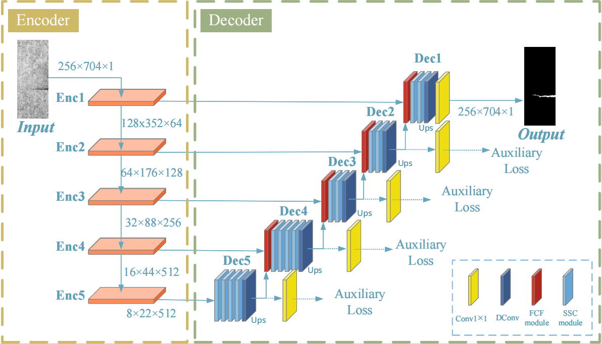

# SKS-Net: Skeleton-strengthening network for surface defect segmentation
## Try to make this as a productive project(on going)
- author: Yubo Zheng / Rongdi Wang
- email: 1287293308@qq.com / wangyi@s.upc.edu.cn
## Implement this paper by Pytorch
[SKS-Net](Currently submitted to "Measurement Science and Technology".)

## Network Arch

## usage
Taking the KolektorSDD1 dataset as an example:

1. Download the KolektorSDD1 dataset and store it in the path ``<your-path>``;
2. Modify the dataset path in the file `utils/generate_txt.py` to the location where you have stored the dataset on your computer ``<your-path>``;
3. Run the script `python utils/generate_txt.py`, which will generate the corresponding annotation files train.txt and test.txt in the location where you have stored the dataset. This will facilitate the instantiation of the data flow;
4. Finally, in the `train.py` file, change the `"--benchmark"` parameter to `"KolektorSDD1"`, and run it `python train.py` to start training and testing. During the training process, the paths `"save/"` and `"log/"` will be generated to store the relevant records.

## Currently supported datasets:
1. KolektorSDD1
2. NEU-Seg
3. CrackForest
4. RSDD1
5. RSDD2

## Currently supported models:
1. U-Net
2. A-Net
3. DeepLabV3
4. PGA-Net
5. EDR-Net
6. PSP-Net
7. ResU-Net++
8. SegFormer
9. Seg-Net
10. SKS-Net (The code will be uploaded after the paper is accepted.)